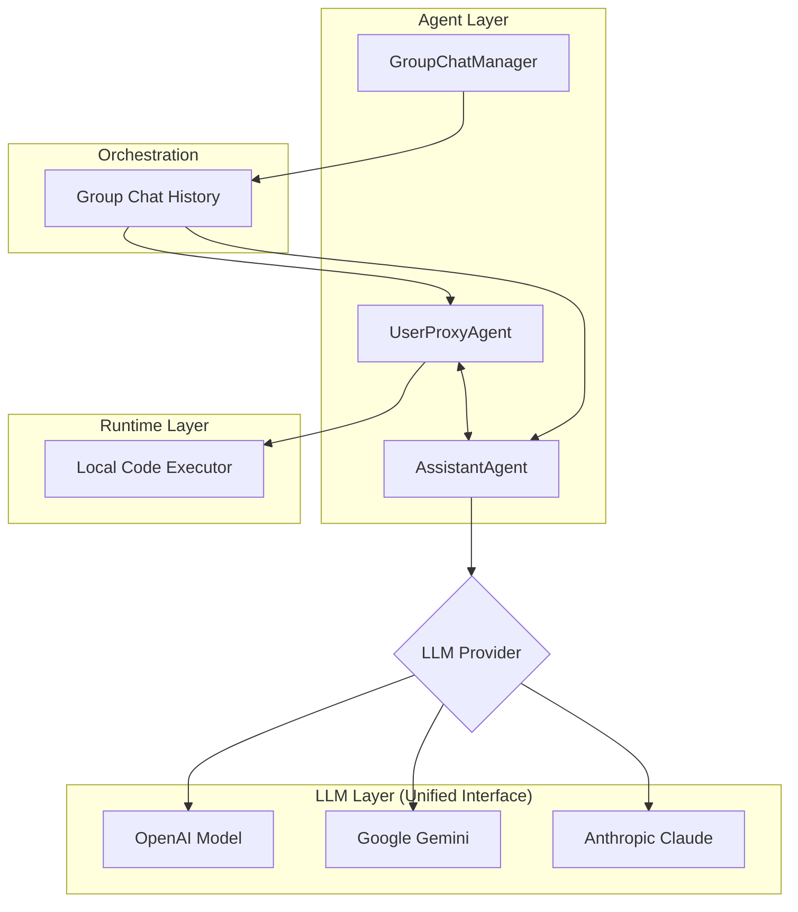

<p align="center">
  
</p>

# TSAutoGen 🚀

**TSAutoGen** is a high-performance, TypeScript-native port of Microsoft's [AutoGen](https://github.com/microsoft/autogen) framework. It enables the creation of multi-agent AI systems that can converse, collaborate, and execute code autonomously, built entirely on the Node.js ecosystem.

[](https://x.com/TSAutoGen)
[](https://www.npmjs.com/package/tsautogen)
[](https://opensource.org/licenses/MIT)

---

## What is TSAutoGen?

TSAutoGen simplifies the orchestration, optimization, and automation of LLM workflows in TypeScript. It offers customizable and conversable agents that leverage the capabilities of advanced LLMs while addressing their limitations by integrating with humans and tools through automated chat.

### Key Features ✨

- **TypeScript Native**: Optimized for the Node.js environment with full type safety and modern ESM support.
- **Multi-Agent Conversation**: Easily define agents with specialized roles and manage their interactions.
- **Autonomous Code Execution**: Securely execute Python and Node.js code generated by agents in a local environment.
- **Pluggable LLM Providers**: Unified interface for **OpenAI**, **Google Gemini**, and **Anthropic Claude**.
- **Flexible Orchestration**: Built-in support for `GroupChat` and `GroupChatManager` for complex workflows.
- **Human-in-the-Loop**: Configurable modes for human intervention (ALWAYS, NEVER, TERMINATE).

---

## Architecture 🏗️

TSAutoGen follows a modular, event-driven architecture designed for scalability and extensibility.

<p align="center">
  
</p>



---

## Installation 📦

```bash
npm install tsautogen
```

## Quick Start 🚀

1. **Set up your environment**:
Create a `.env` file in your project root:
```env
OPENAI_API_KEY=your_openai_key
GOOGLE_API_KEY=your_google_key
ANTHROPIC_API_KEY=your_anthropic_key
```

2. **Run a Basic Chat**:
```typescript
import { AssistantAgent } from 'tsautogen/agent';
import { UserProxyAgent } from 'tsautogen/agent';
import { OpenAIModel } from 'tsautogen/llm';

const assistant = new AssistantAgent({
    name: "Assistant",
    llmModel: new OpenAIModel({ model: "gpt-4o" })
});

const user_proxy = new UserProxyAgent({
    name: "User",
    humanInputMode: "NEVER"
});

await user_proxy.send("What is the capital of France?", assistant);
```

---

## Examples 📚

Explore more advanced patterns in the `examples/` directory:

- [Basic Chat](https://github.com/TSAutoGen/TSAutoGen/blob/main/examples/basic_chat.ts): One-on-one conversation.
- [Code Execution](https://github.com/TSAutoGen/TSAutoGen/blob/main/examples/code_execution.ts): Agents solving tasks by writing and executing scripts.
- [Group Chat](https://github.com/TSAutoGen/TSAutoGen/blob/main/examples/group_chat.ts): Multiple agents collaborating in a team.
- [Gemini Support](https://github.com/TSAutoGen/TSAutoGen/blob/main/examples/gemini_chat.ts): Using Google Gemini as the LLM provider.
- [Claude Support](https://github.com/TSAutoGen/TSAutoGen/blob/main/examples/claude_chat.ts): Using Anthropic Claude as the LLM provider.

---

## Documentation 📖

- [FAQ](FAQ.md)
- [Transparency & Responsible AI](TRANSPARENCY_FAQS.md)
- [Contributing Guide](CONTRIBUTING.md)
- [Support Policy](SUPPORT.md)
- [Security Policy](SECURITY.md)

## Follow Us 🐦

Stay updated with the latest news, tutorials, and community highlights on Twitter: [@TSAutoGen](https://x.com/TSAutoGen).

---

## License 📄

TSAutoGen is released under the [MIT License](LICENSE).

---

[↑ Back to Top ↑](#readme-top)
